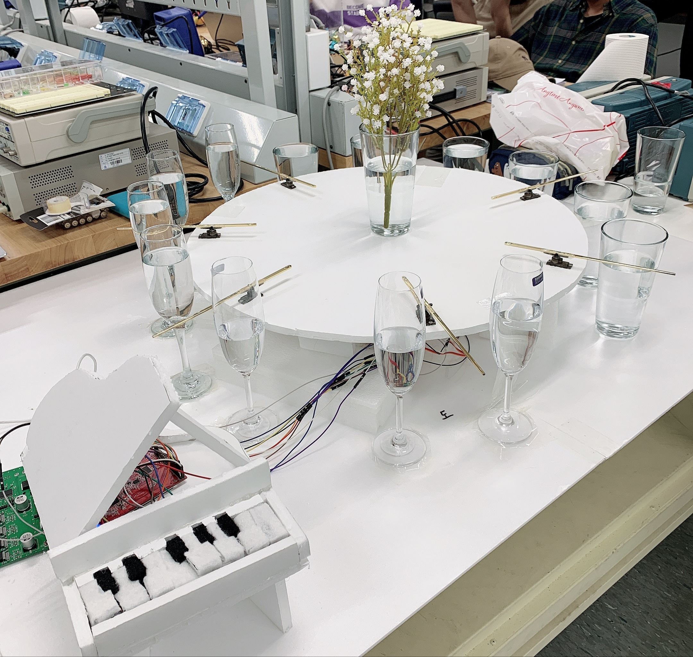

# 내가 꿈꾸는 프로그래머로서의 삶

## 왜 프로그래밍에 관심을?
처음 프로그래밍에 관심을 가지게 된 건 대학교 3학년 때 '마이크로프로세서'라는 과목에서였다.
그 과목에서는 인피니온이라는 회사에서 나온 마이크로 컨트롤러 유닛(MCU)을 이용해서 프로젝트를 진행해야 했다.
같은 동아리였던 후배 친구와 팀이 되어 어떤 것을 만들지 고심하면서 기획했던 순간이 아직도 눈에 선하다.
개발이라는 것을 처음 해보는 것이었기에 너무 어려운 것에 도전하기에는 겁이 났지만, 보기에는 대단해 보이는 것을 만들고 싶었다.
그래서 결정한 것이 '유리잔 피아노'였다.
개발적으로는 버튼형 스위치와 모터 몇 개만 제어하면 충분하다는 것이 큰 이유 중 하나였다.
하지만 그것을 구현하는데도 밤을 며칠씩 새며 많은 시간을 썼는데, 3000페이지가 넘어가는 MCU 영문 설명서를 보면서 모터 제어부가 무엇인지, 어떻게 제어하는지를 찾아야 했기 때문이다.

그럼에도 문제를 해결한다는 느낌이 재미있었다.
특히 하나의 MCU에서 제어할 수 있는 모터의 수가 제한적이어서 한 옥타브도 표현할 수 없었는데, 기발한 방식으로 해결했을 때는 아직도 짜릿하다.
무엇보다도 그 수업이 가장 좋은 기억으로 남은 것은 프로젝트 발표 당일 시연을 할 때 교수님이 크게 칭찬해주셨다는 것이다.
사실 그 때 이후로 본격적으로 '개발자가 되어야지!'하면서 바로 방향을 틀어버린 건 아니지만 그 때의 좋았던 기억이 지금의 나를 만든 게 아닌가 싶다.

 

## 프로그래머로서 어떻게 살것인지?
내가 꿈꾸는 프로그래머의 삶이라는 주제로 글을 쓰면서 사설이 길었는데 사실 지금까지 개발자가 되면 이런 삶을 살아야지하는 생각을 구체적으로 해본 적은 없다.
개발자는 단지 직업이라고 생각하고 있고 단지 직업을 선택할 때 내가 즐겁게 할 수 있는가를 큰 가치로 두었다.
그래서 문제를 해결하는 것을 재밌어하고, 평소 게임을 좋아했기 때문에 개발자를 선택하게 된 것 뿐이다.

그래서 꼭 개발자가 아니더라도 직업을 가진 후에는 그 동안 하고 싶었음에도 돈이 없어서 하지 못 했던 것들을 꼭 하고 싶었다.
주짓수 혹은 복싱 배우기, 좋은 그래픽 카드 달린 데스크톱 사서 게임하기, 클라이밍 다니기 등등 퇴근 후의 삶을 꿈꿔왔다.
하지만 지금까지 우테코에서 개발자를 준비하며 느낀 개발자로서의 삶에 대한 감상은 '과연 내가 꿈꿨던 것들을 다 할 수 있을까'라는 것이다.
우선 취직을 하더라도 끊임없이 배워야 한다.
당장 지금 내가 가지고 있는 개발자로서의 지식이 몇 년후에는 구닥다리가 될 수도 있을 만큼 발전이 빠른 분야이다.
해야 하는 일도 수시로 바뀐다.
사용하는 기술 스택이 다른 프로젝트들을 병렬적으로 진행할 수도 있고, 이직하는 경우도 잦다.

내가 하고 싶은 일보다 내가 해야 되는 일들의 우선 순위를 높게 두기에 계속해서 공부도 하고, 업무 파악도 하겠지만 그러다 보면 내가 살고 싶은 삶을 살고 있을지는 잘 모르겠다.
다만 좀 더 프로그래머의 삶이라는 관점에서 보면 내 손에서 만들어지는 서비스가 '사람과 사회에 도움이 되는 것'이었으면 한다.
기술에 매몰되기 보다는 내가 해결하고 싶은 문제들을 풀어나가는 개발자가 될 수 있기를 꿈꾼다.