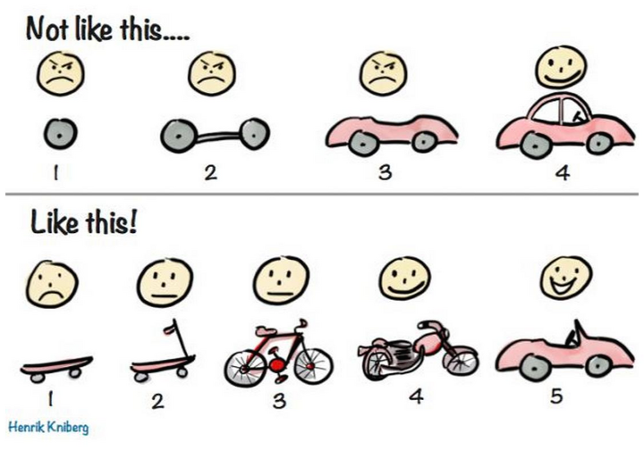

# 학습과 협력을 고민하는 함께 자라기

## 책 소개 - 함께 자라기 (애자일로 가는 길)

애자일(Agile)은 소프트웨어 개발 방법론이다. 처음부터 끝까지 계획을 수립하고 개발하는 폭포수(Waterfall) 방법론과 달리 개발과 함께 즉시 피드백을 받아서 유동적으로 개발하는 방법이다.  
'함께 자라기'라는 책 제목을 보면 협업과 관련된 이야기가 많을 것 같다. 하지만 목차를 보면 '자라기'가 먼저 나오고 '함께'가 후에 나온다. 그리고 마지막으로 '애자일'에 대해 설명한다.  
저자가 말하고자 하는 바는 협업을 잘하는 방법이 아니라 학습과 협력을 통해 불확실한 상황에서의 문제를 해결하는 방법에 대해 이야기하는 것이다.  
책을 읽으며 인상적이었던 부분과 직접 적용해보며 고민할 수 있었던 주제들을 소개하고자 한다.

## [자라기] - 잘하기 vs 자라기

실행 프레임과 학습 프레임으로 나눈 실험을 통해 '지속 가능한 학습'에 대해 이야기 한다.

> 한 초등학교의 아이들을 무작위로 두 그룹으로 나눈다. 한 그룹의 아이들에게는 '얼마나 그림을 잘 그리는지 창의성을 측정하고 점수를 매긴다'고 한다. 다른 그룹의 아이들에게는 '내가 안 그려보았던 방법을 실험해보는 시간이다. 여러가지 방법으로 실험해보라'고 한다. 전자는 '잘하기'에 초점을 맞추게 하고, 후자는 '자라기'에 초점을 맞추게 한다. 그림 그리는 시간이 끝나고 쉬는 시간에 아이들의 행동을 관찰해 보면, 실행 프레임의 아이들은 논다고 정신이 없다. 학습 프레임의 아이들은 여전히 계속 그림을 그리는 아이들이 많다. 실험 이후 아이들이 그림 그리기에 대해 학습한 정도를 비교해 보면 학습 프레임의 아이들이 훨씬 더 많이 학습한다.

책의 내용 중 가장 인상이 깊었던 부분이다. 승부욕이 강한 나는 항상 남들보다 잘해야 만족하고, 목표를 달성해야 성취감을 느끼곤 한다. 특히 스포츠를 좋아해 승리가 가져다주는 도파민을 잊지 못한다.  
하지만 사실 승리의 쾌감이 클수록 패배에 대한 우울감도 크게 다가온다. 세상에 나보다 뛰어난 사람은 왜 이렇게 많을까. 나는 왜 저 사람만큼 하지 못할까. 우울과 슬럼프에서 벗어나지 못한 적이 있었다.  
우아한테크코스를 하면서도 주변 사람들에게 압도되어서 빠른 성장과 결과만을 갈망했다. 그럴수록 더 학습하기 싫어하는 나를 발견하게 되었고, 책을 통해 다시금 힘을 얻게 되었다.

혹시 번아웃이 오거나 지친 마음에서 벗어나는게 힘들다면 다음과 같이 생각해보자.

- 너무 잘하려고만 하고 있는 것은 아닌가?
- 지금 이 상황을 통해 배우려고 하는 것이 무엇인가?
- 지금 상황 '때문에' 학습 프레임을 갖기 힘들다는 생각이 든다면 '덕분에' 학습 프레임을 가질 수 있다고 생각해보면 어떨까?

## [함께] - 코치는 선수가 아니다

나는 문제를 분석하고 해결하는 것을 좋아한다. 특히 다른 사람이 문제를 겪고 있을 때 왜 그렇게 되었는지 파악하고 어떻게 도움을 줄 수 있을지에 대해 고민한다.  
우아한테크코스에서 레벨1 기간동안 크루들이 겪는 git 문제부터 자바스크립트의 다양한 문제들을 함께 고민하고 해결하였다. 하지만 레벨2에 들어서면서 프레임워크를 다루게 되고 점점 문제는 복잡해져서 내가 모든 것을 이해할 수는 없었다.  
이런 고민을 하고 있었을 때 아래 책에서 나온 대화 내용이 도움이 되었다.

> [술퍼맨] : 이런 문자열을 잡아내려면 패턴을 어떻게 써야 하는지 감이 잘 안오네요. 정규식이 익숙하질 않아서...  
> [홍춘이] : 정규식에 익숙해지기가 어렵죠.  
> [술퍼맨] : 네.. 그런 것 같아요.  
> [홍춘이] : 한번 같이 볼까요? (들여다본다) 호오... 이럴 때는 어떻게 하면 될까? 술퍼맨님은 어떤 시도를 해보셨어요?  
> [술퍼맨] : "어쩌구저쩌구"라고 넣어봤어요.
> [홍춘이] : 어떻게 하다가 그런 시도를 하게 되셨어요?  
> [술퍼맨] : 일단 요 부분은 고정되어 있으니까 그대로 쓰면 될 것 같아서 이렇게 했고, 여기가 좀 애매했는데요, 우선은 '또는(OR)' 조건이니까 이렇게 해서요...  
> [홍춘이] : 나름대로 전략을 갖고 하셨네요. 좋아요. 그럼 실제로 패턴 매칭이 되는지 안 되는지는 어떻게 확인하셨는지 궁금하네요.  
> [술퍼맨] : 간단하게 코드를 짜서 print로 찍어봤거든요.  
> [홍춘이] : 아, 그랬군요. 매번 바꾸고 실행하고 하기가 귀찮았겠네요. 한번 볼 수 있을까요?  
> [술퍼맨] : 네. 하다가 보면 귀찮아서 확인 작업을 건너뛰기도 하고 그랬죠. (술퍼맨이 시연을 한다.)  
> [홍춘이] : 말씀하신 대로 안 되는 부분이 있네요. 다른 시도를 위해서 뭘 해보셨나요?  
> [술퍼맨] : 우선 구글 검색을 해봤는데요.  
> [홍춘이] : 검색한 키워드가 궁금하네요. 저도 모르는 부분은 검색을 하거든요. 검색 히스토리를 한 번 보면 어떨까요?

상대방에게 어떤 식으로 이해하고 있는지, 모르는 문제를 만났을 때 어떻게 해결하려고 시도하는지, 자신의 답이 맞는지를 어떻게 확인하는지 사고 흐름을 파악한다. 그 사람이 이 상황에서 왜 이런 접근을 할 수 밖에 없었는지 알기 때문에 좀 더 정확하고 효과적인 제안을 해줄 수 있다.

코치는 선수만큼 잘하지 않아도 된다고 한다. 자신이 잘 모르는 문제에 대해 도움을 주고자 한다면 그 사람의 사고 과정과 전략을 이해하고 핵심적인 부분을 짚어주자.

- 상대방이 문제를 겪기까지 어떤식으로 이해하고 있는지?
- 문제를 만났을 때 어떻게 해결하려고 시도하는지?
- 다른 방식으로 접근한다면 어떻게 될지?

## [애자일] - 해결법 보다는 접근법

책의 부제가 '애자일로 가는길'이라고 하면서 애자일에 대한 내용은 짧다. 왜인가 생각해보면 이미 '자라기'와 '함께'에 대해서 충분히 공감을 한다면 애자일을 실천하고 있는 것과 마찬가지기 때문이다.

저자가 애자일에 대해 짧게 쓴 것처럼 나도 애자일에 대해 특정하고 싶지 않다. 애자일은 명확한 '해결법'이 아니라 학습과 협력을 통해 문제를 해결하려는 '접근법'이라고 생각했기 때문이다.

혹시 애자일에 대해 더 궁금하다면 이 책을 한 번 읽어보고 '고객에게 매일 가치를 전하라'는 말의 뜻을 고민해보자.

