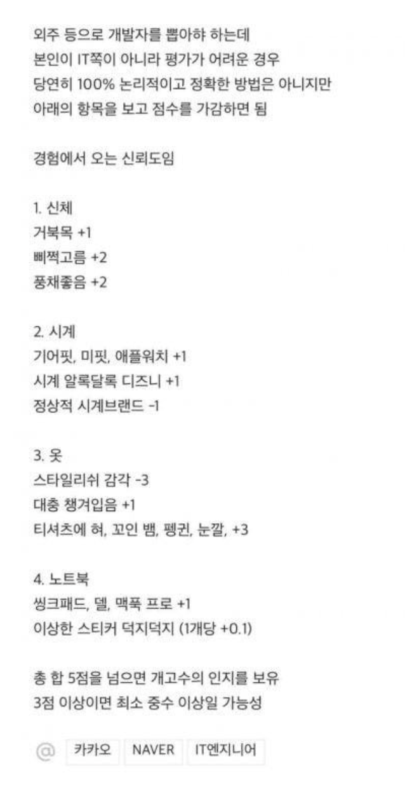

## 🌈 현실에 안주하지 않는, 고여있지 않은 프로그래머가 되고 싶습니다.

시간이 흐를수록 사람은 안주하기 쉽습니다.
프로그래머라는 직업은 안주하면 도태되기 쉽습니다. 그래서 끊임없이 성장하려 노력해야 합니다. 저에겐 이 점이 매력으로서 다가왔습니다. 반복적이고 단순한 일에는 빠른 지루함을 느끼기 때문입니다. 머리도 몸도 쓰는대로 굳어지기에, 끝없는 학습을 통해 미래에 발전적인 스스로를 마주하고 싶습니다.

끊임없이 스스로를 새로운 환경에 노출시키고 그 속에서 깨달음을 얻고 성장하는 것을 즐깁니다.
학교생활에 안주하지 않고 인턴에 도전하고 창업에 시도하고 또 새로운 인턴에 지원했었습니다.
그리고 올해는 우테코에서 성장 중입니다.
즉, 변화와 성장에서 살아있음을 느낍니다.
10년이 지나도 반짝반짝 빛나는 사람이 되고 싶습니다.
미래에 후배 혹은 동료에게 고인 물이 아닌 새로운 통찰을 전해주고 싶습니다.
이는 열려있는 태도와도 연결됩니다.
내 방식만이 옳은 것이 아닌 다른 사람의 의견을 귀 기울일 수 있는 유연한 사람이 되고 싶습니다.

## 🌎 시공간에 제약받지 않는 프로그래머가 되고 싶습니다.

'음식'과 '여행'을 정말 좋아합니다. 이 두가지를 통해 인생에서 큰 행복감과 만족감을 느낍니다.
따라서 지구에서 태어난 이상, 죽기 전까지 최대한 많은 문화와 음식과 나라를 경험해보고 싶습니다.

프로그래머라는 직업은 노트북만 있으면 언제 어디서든 일할 수 있습니다.
상대적으로 다른 직무에 비해서, 공간의 제약이 적고 자율성이 높은 직무라고 생각합니다.
노트북만을 들고 떠나 내가 머무르고 싶은 곳에서 프로그래밍하는 삶.
비록 허황된 꿈일지라도, 떠올리면 행복해지는 상상입니다.

## 🔨 프로그래머라는 편견을 깨는 프로그래머가 되고 싶습니다.

보통 개발자 하면 떠올리는 이미지가 있습니다.
그곳에 국한되기 싫습니다.
프로그래밍만을 잘해서 좋은 프로그래머가 될 수 있을까요?
너무 한곳에 매몰되면, 다른 직군과의 소통과 협업이 어려워진다고 생각합니다.
기획자, 디자이너와의 능동적인 교류를 통해 프로젝트 성공률을 높이고 싶습니다.

프로그래머의 수요와 공급이 점점 늘고 있고, 다양한 사람이 프로그래머를 꿈꾸고 있습니다.
그 흐름에 따라 프로그래머에 대한 인식의 다양성을 넓히고, 새로운 시각과 특별한 색을 지닐 수 있는 프로그래머가 되고 싶습니다.

## 💫 문제를 해결하고 세상을 바꾸는 소프트웨어를 탄생시키는 프로그래머가 되고 싶습니다.

이는 제가 프로그래머라는 꿈을 가지게 된 계기입니다. 고3 때 처음 프로그래밍(파이썬)을 접하고 세상을 바꾸는 소프트웨어들에 주목했습니다. 이때부터 막연하게 'IT 회사의 ceo 혹은 소프트웨어 개발자'라는 꿈을 가지게 되었습니다. 내가 만든 서비스로 사람들의 행동양식이 바뀌고 세상을 영향력을 끼칠 수 있다라는 생각은 가슴을 뛰게 했습니다. 결국 3년 동안 고수했던 '생명공학과'로의 진학을 포기하고, 학교선생님들의 만류에도 불구하고 '컴퓨터공학과'로의 진학의 변경을 결정했습니다.

소프트웨어는 큰 자본 없이, 세상에 영향력을 끼칠 수 있는 가장 효과적인 수단입니다. 미래에 문제점 혹은 새로운 가치를 발견한다면, 곧바로 내가 원하는 아이디어를 실현시킬 수 있는 능력있는 프로그래머가 되고 싶습니다.
